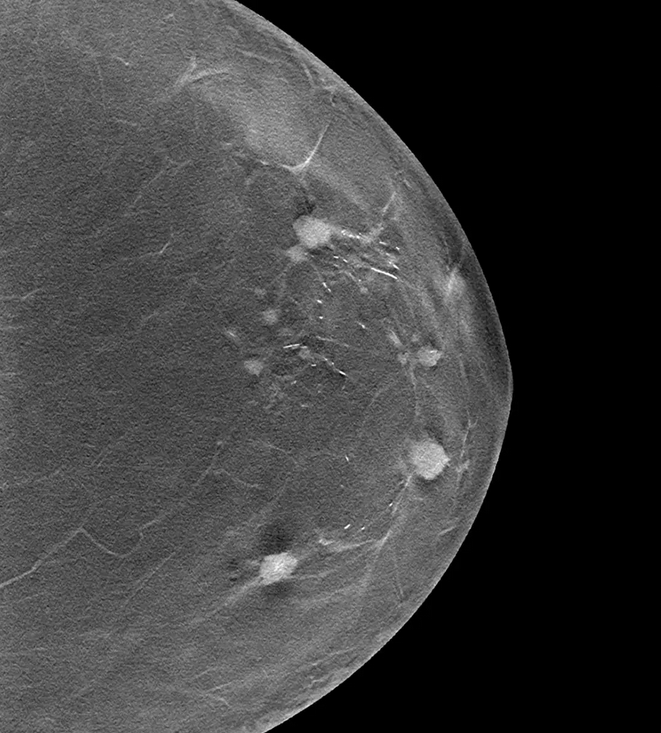

# Mammography Analysis Tool



## Overview

The Mammography Analysis Tool is a Python application designed for processing mammography images. It provides a user-friendly graphical interface that allows users to load, process, and visualize mammography images. The application utilizes OpenCV for image manipulation and analysis, enabling users to identify and mark areas of concentration in the images.

## Example Results

### Before and After Processing

The Mammography Analysis Tool allows you to see the original mammography image alongside the processed version, highlighting areas of concentration that may require further examination.


*Original mammography image*


*Processed image with highlighted areas of concentration*

The processing algorithm applies specialized filters to enhance potential regions of interest, making it easier for medical professionals to identify areas that might need closer examination.

### Interpretation

- **Bright areas** in the processed image often indicate denser tissue
- **Highlighted contours** show boundaries of potential areas of interest
- **Color-coded regions** (if enabled) can represent different density levels

Note: These images are examples only. Always consult with qualified medical professionals for proper diagnosis and interpretation of mammography results.

## Features

- Load various image formats (PNG, JPG, BMP, TIFF, GIF).
- Process images to highlight areas of concentration.
- Display original and processed images side by side.
- User-friendly GUI built with Tkinter.

## Installation

1. Clone the repository:
    ```
    git clone <repository-url>
    cd mammography-analysis
    ```

2. Install the required dependencies:
    ```
    pip install -r requirements.txt
    ```

## Usage

1. Run the application:
    ```
    python src/main.py
    ```

2. Use the "Load Image" button to select a mammography image from your file system.

3. Click on "Process Image" to analyze the loaded image and highlight areas of concentration.

4. The original and processed images will be displayed side by side in the application.

